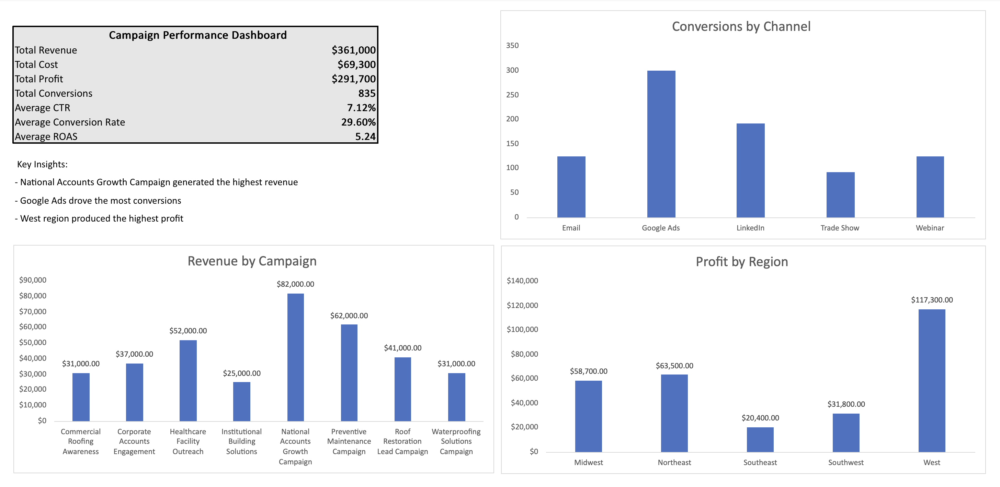

# Campaign Performance Analytics Dashboard

## Overview
This project analyzes marketing campaign performance data to identify trends, engagement results, and optimization opportunities.

## Tools Used
- Excel
- Pivot Tables
- Data Visualization

## Key Metrics
- Revenue
- Cost
- Profit
- Conversions
- Click-Through Rate (CTR)
- Conversion Rate
- Return on Ad Spend (ROAS)

## Key Insights
- National Accounts Growth Campaign generated the highest revenue ($82,000)
- Google Ads drove the most conversions (300)
- West region produced the highest profit ($117,300)

## Dashboard Preview

## Summary
This project demonstrates the ability to analyze campaign performance and present insights in a clear, business-focused dashboard.
